# Project Complete Understanding Guide

This guide is a comprehensive, beginner-friendly, yet interview-ready technical document designed to help you understand the **Job Pilot** application from 0% to 100%. It contains code-flow explanations, tech stack breakdowns, and answers to potential interview questions so you can explain the project with absolute confidence.

---

## 1. Project Overview

**Job Pilot** is a full-stack, automation-driven Job CRM and application tracking dashboard. Instead of manually scrolling through multiple job boards, copy-pasting links, and using Excel sheets to manage job hunt statuses, Job Pilot integrates data aggregation, AI screening, and visual tracking into a single dashboard.

* **What it is:** A web-based career management platform that centralizes job opportunities collected from automated web scrapers.
* **What problem it solves:** Eliminates the manual overhead of visiting individual platforms, tracking applications across messy spreadsheets, and spending hours screening unqualified or irrelevant jobs.
* **Who the target user is:** Active software developers and job seekers (specifically focused on MERN/Frontend roles in this implementation) who want to streamline their job search.
* **Why it is useful:** It introduces automation to the job hunt, instantly scoring opportunities based on relevance so the candidate can focus only on top-tier matches.
* **What makes it different from a basic CRUD app:** 
  Unlike a basic "Create-Read-Update-Delete" list:
  1. **Automated Data Ingestion:** Jobs enter the system automatically via webhooks triggered by n8n automation pipelines.
  2. **AI Fit Assessment:** Opportunities are dynamically graded (0–100%) using LLM APIs to match a developer's target profile before showing up on the board.
  3. **Optimistic UI Engine:** Drag-and-drop status moves and database updates happen with zero perceived latency, rolling back automatically if server requests fail.
  4. **Smart Debounced Edits:** Interview notes are saved in the background using debounce techniques to limit database load.

> **Summary Statement for Interviews:**
> *"This project is an automated Job Tracking / Job CRM dashboard where job opportunities are automatically fetched via n8n workflows, scored for relevance using Gemini AI, and managed through a sleek Kanban board. It reduces manual job search effort by centralizing and ranking all opportunities in one place."*

---

## 2. Problem Statement

Job hunting in the modern tech landscape is highly fragmented:
* **Platform Fragmentation:** Job openings are scattered across LinkedIn, Indeed, Glassdoor, Wellfound, and company career pages, causing "tab overload."
* **No Centralized Funnel:** Candidates lose track of where they applied, when they applied, and what stage they are in (Applied, Interviewing, Offer, or Rejected).
* **The "Black Box" of Relevancy:** Searching for "React Developer" often yields unrelated roles (e.g., C# desktop developer, PHP developers) or senior roles requiring 10+ years of experience.
* **Scattered Preparation Notes:** Interview details, recruiter email threads, and custom preparation notes are stored in local notebooks or scattered files.
* **Duplicate listings:** The same job is frequently reposted across different boards, leading to duplicate applications and wasted time.

### How Job Pilot Solves This:
1. **Unified Pipeline:** Ingests jobs from multiple boards into a single MongoDB collection.
2. **Deduplication Logic:** Matches jobs based on title-company combinations or unique `job_id` values to prevent duplicate entries.
3. **AI-Fitted Compatibility Insights:** Gemini AI reads the full job description and scores it (e.g., 90% Match) with a brief reason, allowing the user to filter for "Ready to Apply" jobs instantly.
4. **Visual Kanban Tracking:** Offers a Trello-like board to organize applications visually.
5. **Debounced Notes Editor:** Keeps all recruiters' contact info, salary discussions, and interview notes inside the job card itself.

---

## 3. Tech Stack

| Layer | Technology | Purpose / Role in Project |
| :--- | :--- | :--- |
| **Frontend** | **Next.js 16.2.2 (React 19)** | App Router framework for page loading, API routes, and client-side view rendering. |
| **Styling** | **Tailwind CSS v4 + Radix UI** | Modern CSS system for dark-mode styling, grid systems, and glassmorphic designs. |
| **Animations** | **Framer Motion v12** | Handles layout animations, spring exits, drag-and-drop card transitions, and cross-fades. |
| **Backend** | **Next.js API Routes** | Standard serverless API endpoints (`/api/jobs` and `/api/webhook`) for database operations. |
| **Database** | **MongoDB & Mongoose v9** | Document-based database for job storage; Mongoose registers schema blueprints. |
| **Automation** | **n8n Workflow Engine** | Automated scraper pipeline that runs on schedule to find jobs and post them to our backend. |
| **AI Scoring** | **Gemini / OpenRouter API** | Summarizes job descriptions and calculates matching scores based on tech compatibility. |
| **Theme System** | **next-themes** | Prevents hydration mismatch and flashes of wrong color scheme during SSR theme checks. |
| **Notifications** | **Sonner** | iOS-style stacking popups for success alerts, errors, and progress indicators. |

---

## 4. Folder Structure Explanation

```txt
job-pilot/
├── app/
│   ├── api/
│   │   ├── jobs/
│   │   │   ├── [id]/
│   │   │   │   └── route.ts       → PATCH (update status/notes) & DELETE (remove job) endpoints
│   │   │   └── route.ts           → POST (upsert jobs based on job_id or title+company)
│   │   └── webhook/
│   │       └── route.ts           → POST (direct endpoint for raw n8n database inserts)
│   ├── dashboard/
│   │   └── page.tsx               → Server component fetching all jobs from DB with date serialization
│   ├── globals.css                → Tailwind CSS styles, custom scrollbar, & dark theme variables
│   ├── layout.tsx                 → Main wrapper setup injecting ThemeProvider and global toast <Toaster />
│   └── page.tsx                   → Glassmorphic landing page displaying features and Enter button
├── components/
│   ├── jobs/
│   │   ├── DeleteJobButton.tsx    → Modular button with delete confirmation & router.refresh() trigger
│   │   ├── JobDashboard.tsx       → Client component containing search, filters, state, and table/board views
│   │   ├── JobNotesEditor.tsx     → Collapsible text area with a 700ms debounce save hook
│   │   ├── KanbanBoard.tsx        → HTML5 Drag & Drop columns grouping jobs by status
│   │   ├── Pagination.tsx         → Page changer updating "?page=X" parameters without state loss
│   │   └── ViewToggle.tsx         → Switches visual state (?view=list or ?view=board)
│   ├── theme/
│   │   └── ThemeToggle.tsx        → Hydration-safe light/dark mode icon switcher with motion crossfades
│   └── ui/                        → Radix UI atoms (badge, button, card, table, toaster)
├── lib/
│   ├── jobFilters.ts              → Pure helper functions for parsing dates, matching locations, and sorting
│   ├── mongodb.ts                 → Singleton mongoose database connection helper
│   └── utils.ts                   → Tailwind merge utility (cn)
├── models/
│   └── Job.ts                     → Mongoose Schema blueprint representing database fields and enums
├── providers/
│   └── ThemeProvider.tsx          → Wrapper using next-themes to inject "dark" class into <html>
├── package.json                   → Lists scripts (dev, build) and dependency versions (Next, React, Mongoose)
├── tsconfig.json                  → TypeScript configurations
└── .env                           → Local connection variables (MONGODB_URI)
```

---

## 5. Complete User Flow

```mermaid
sequenceDiagram
    autonumber
    actor User
    participant Browser as Client Browser (React)
    participant NextServer as Next.js Server (API/Page)
    participant DB as MongoDB Atlas

    User->>Browser: Opens Landing Page (/)
    Browser->>User: Renders Glassmorphic Hero UI
    User->>Browser: Clicks "Enter Dashboard"
    Browser->>NextServer: Requests /dashboard
    Note over NextServer: force-dynamic page load
    NextServer->>DB: connectToDatabase() & Job.find({}).lean()
    DB-->>NextServer: Returns array of job documents
    Note over NextServer: Stringifies _id and post Date (Serialization)
    NextServer-->>Browser: Sends fully-rendered Server page + JSON state
    Browser->>User: Displays Job Dashboard (List/Kanban view)
    
    rect rgb(30, 41, 59)
        note over Browser, NextServer: User updates job status (Applied/Interviewing)
        User->>Browser: Selects new dropdown value OR drags card on Kanban
        Browser->>Browser: Optimistically updates UI state (Instant change)
        Browser->>NextServer: PATCH /api/jobs/[id] with { status: newStatus }
        NextServer->>DB: Job.findByIdAndUpdate(id, { status })
        DB-->>NextServer: Acknowledged
        NextServer-->>Browser: Returns 200 OK + Updated Job
        Note over Browser: If failed, rolls back local state to original backup
    end

    rect rgb(15, 23, 42)
        note over Browser, NextServer: User types Interview Notes
        User->>Browser: Types in Notes text area
        Note over Browser: Waits for 700ms pause (Debounce)
        Browser->>NextServer: PATCH /api/jobs/[id] with { notes }
        NextServer->>DB: Job.findByIdAndUpdate(id, { notes })
        DB-->>NextServer: Acknowledged
        NextServer-->>Browser: Shows "Saved" checkmark
    end
```



---

## 6. Automation Flow

Jobs enter the database automatically through a scheduled background automation. Here is how n8n workflows process job opportunities:

```txt
                  [ n8n Automation Engine ]
                              │
  1. Cron Trigger (Runs daily or every few hours)
                              │
                              ▼
  2. Search Nodes (Hits SerpAPI Google Jobs API for "React Developer")
                              │
                              ▼
  3. JSON Parser / Normalization (Extracts title, company, salary, description)
                              │
                              ▼
  4. Relevance Filtering (Keeps React/Node; rejects PHP/Android keywords)
                              │
                              ▼
  5. AI Evaluation (Sends description to Gemini/OpenRouter to calculate Fit Score)
                              │
                              ▼
  6. Final Ingestion Request (POST to http://localhost:3000/api/jobs)
                              │
                              ▼
                  [ Next.js API endpoint ]
                              │
  7. Mongoose updates database (Checks for duplicate job_id or title+company)
                              │
                              ▼
                  [ MongoDB job_pilot_db ]
```

### Interview Explanation:
*"The database is populated asynchronously. We set up an n8n workflow that triggers on a schedule. It queries SerpAPI to fetch Google Job listings, filters them locally to eliminate noise (like QA or Mobile developer roles), and passes the job details to Gemini AI. The AI evaluates the description against our developer profile, outputting a match score (0–100) and a brief reasoning. n8n then sends this structured JSON to our Next.js `/api/jobs` endpoint, which performs an upsert in MongoDB."*

---

## 7. Frontend Pages

### 1. Landing Page (Root Route)
* **Path:** `/`
* **File:** `app/page.tsx`
* **Purpose:** Entry portal. It uses a modern glassmorphic SaaS design with floating ambient glows to make a premium first impression.
* **Features:**
  * Animated feature cards displaying value propositions (Smart Filtering, Optimistic Shifts, Responsive Skeletons).
  * Navigation to the dashboard via "Enter Dashboard" or "Sign In".
  * Integration with the Global theme toggle.
* **API Calls:** None.

### 2. Dashboard Page
* **Path:** `/dashboard`
* **File:** `app/dashboard/page.tsx`
* **Purpose:** Main workspace. It acts as a Server Component to pull initial database records.
* **Features:**
  * Direct MongoDB connection using Mongoose.
  * Date and ID serialization to satisfy Next.js page boundary constraints.
  * Serves as the page skeleton, injecting data directly into the client-side `<JobDashboard>` component.
* **API Calls:** Direct server query (`Job.find({}).lean()`).

---

## 8. Frontend Components

### 1. `JobDashboard`
* **File:** `components/jobs/JobDashboard.tsx`
* **Purpose:** Client-side workspace manager. It handles searching, sorting, pagination, and toggle layouts.
* **State Managed:**
  * `jobs`: Local array of jobs (initially populated from `initialJobs`).
  * `updatingId`: Tracks which job is sending a PATCH update.
  * `deletingId`: Tracks which job is sending a DELETE request.
  * `searchTerm`: Debounced input state.
* **Props Received:**
  * `initialJobs`: array of serialized MongoDB Job documents.
* **Key Events:**
  * `handleStatusChange()`: Changes status optimistically and calls `PATCH /api/jobs/[id]`.
  * `handleDelete()`: Requests confirmation, updates state locally, and calls `DELETE /api/jobs/[id]`.

### 2. `KanbanBoard`
* **File:** `components/jobs/KanbanBoard.tsx`
* **Purpose:** Renders a Trello-style board grouping jobs into status columns.
* **Key Interactions:**
  * Implements Native HTML5 Drag and Drop (`onDragStart`, `onDragOver`, `onDrop`).
  * Triggers status changes on the parent when a card is dropped into a new column.
* **Props Received:**
  * `jobs`, `onStatusChange`, `onDelete`, `onApplyClick`, `deletingId`.

### 3. `JobNotesEditor`
* **File:** `components/jobs/JobNotesEditor.tsx`
* **Purpose:** An expandable notes textbox inside Kanban cards.
* **Key Interactions:**
  * Captures user keystrokes.
  * Implements a **700ms debounce** inside a `useEffect` hook to prevent sending a request on every single letter typed.
  * Renders status states: "Saving...", "Saved" (with a green checkmark), or "Error".

### 4. `Pagination`
* **File:** `components/jobs/Pagination.tsx`
* **Purpose:** Multi-page navigation (8 items per page).
* **Key Interactions:**
  * Appends `?page=X` to search parameters using Next.js `useRouter`.
  * Preserves existing search, filter, and score queries in the URL.

---

## 9. Backend APIs

| Method | Endpoint | Handler File | Request Body | Response JSON | Database Operation |
| :--- | :--- | :--- | :--- | :--- | :--- |
| **POST** | `/api/jobs` | `app/api/jobs/route.ts` | `{ title, company, score, reason, applyLink, location, salary, postedDate, job_id }` | `{ success: true, data: JobDocument }` | `findOneAndUpdate()` with `{ upsert: true }` based on `job_id` or `title` + `company` combination. |
| **POST** | `/api/webhook` | `app/api/webhook/route.ts` | Raw n8n Job Payload | `{ message: "Success", id: String }` | `Job.create()` to directly insert a new document. |
| **PATCH** | `/api/jobs/[id]` | `app/api/jobs/[id]/route.ts` | `{ status }` and/or `{ notes }` | `{ success: true, data: JobDocument }` | `findByIdAndUpdate(id, { $set: updateData })` |
| **DELETE** | `/api/jobs/[id]` | `app/api/jobs/[id]/route.ts` | None | `{ message: "Deleted successfully" }` | `findByIdAndDelete(id)` |

---

## 10. Database Models / Collections

We define the structure of our job documents inside `models/Job.ts`. It registers a single collection `jobs` in MongoDB.

### Fields and Types:
1. `title` (String, required, default: "Untitled Position"): Job designation.
2. `company` (String, default: "Unknown Company"): Hiring employer.
3. `score` (Number, default: 0): AI computed fit rating (0 to 100).
4. `reason` (String, default: ""): Brief bullet points on why this fit score was calculated.
5. `source` (String, default: "n8n"): Aggregator origin.
6. `applyLink` (String, default: ""): Destination application URL.
7. `location` (String, default: "Anywhere"): Geographic details (e.g. Remote, Indore, Pune).
8. `salary` (String, default: "Not mentioned"): Financial packages.
9. `postedDate` (String, default: "Unknown"): Human-readable posted age (e.g., "2 days ago").
10. `postedAt` (Date, default: Date.now): Exact database ingestion stamp.
11. `job_id` (String, unique, sparse): Unique identifier matching Serpent/API IDs to prevent double entry.
12. `status` (String, default: "Not Applied"): Enforced enum matching: `["Not Applied", "Applied", "Interviewing", "Offer", "Rejected"]`.
13. `notes` (String, default: ""): Candidate-written preparation remarks.

### CRM Relevance:
* The `status` field drives the columns on the Kanban board.
* The `score` field allows candidates to sort and prioritize high-matching jobs.
* `job_id` and `title`+`company` indexes ensure no duplicate job applications show up, preserving database hygiene.

---

## 11. Authentication Flow

Authentication is currently structured as a **clean, modular placeholder** to demonstrate a production-ready application layout.
* **Landing Page:** Features a "Sign In" button leading directly to `/dashboard`.
* **Dashboard Header:** Renders a badge indicating `Active Session • Local DB Connected` to represent successful database communication.
* **Future scope:** Auth can be integrated using library systems like **NextAuth.js (Auth.js)** or **Clerk** by securing the routes inside a Next.js `middleware.ts` file.

---

## 12. Important Features and Implementation Details

### A. URL-Driven Search & Filters
Instead of managing filters inside volatile React state (which resets on page reload), Job Pilot syncs filters directly in the URL:
* Clicking a filter updates query variables (e.g., `/dashboard?status=Interviewing&score=high`).
* This enables users to bookmark their search views or share filtered job boards.
* To prevent lagging database searches, a **300ms debounce** controls the text search. The input changes instantly, but the URL update (which triggers database matching) waits until the user pauses typing.

### B. Optimistic UI Updates
When dragging a card or changing the status:
1. The dashboard immediately moves the card in local state (`setJobs`).
2. The UI reflects the change with zero delay.
3. An asynchronous `fetch(PATCH)` request is sent to the server.
4. **Error Rollback:** If the network is down or the database errors, a catch block catches the rejection, reverts the UI state to a backup copy of the original array, and triggers a warning toast.

### C. Kanban Drag & Drop
* Constructed using HTML5 drag events.
* `onDragStart` saves the target job's database ID inside `e.dataTransfer`.
* Columns intercept `onDragOver` (calling `e.preventDefault()` to permit drop highlights) and `onDrop`.
* On drop, the ID is retrieved and `handleStatusChange(id, targetStatus)` is fired.

### D. Debounced Notes Saving
Writing notes requires continuous typing. Saving on every keypress would send hundreds of PATCH requests to the server, resulting in database lockups or rate limits.
```typescript
useEffect(() => {
  if (notes === initialNotes) return;
  const handler = setTimeout(async () => {
    // API PATCH Call happens here
  }, 700);
  return () => clearTimeout(handler);
}, [notes]);
```
Every keypress triggers a component re-render, clearing the active timeout. The moment the user stops typing for 700ms, the timeout executes and persists the text.

### E. Dark Mode & Toasters
* **Library:** `next-themes` wraps the DOM inside `ThemeProvider.tsx`.
* **Hydration mismatch fix:** Because servers do not know the user's browser theme preference, the toggle component checks if it is `mounted` before rendering icons. If not mounted, it renders a visual placeholder to prevent layout shifts.
* **Toasts:** Sonner (`sonner`) reads the active theme (`light` or `dark`) via hooks and renders stacked, high-contrast notifications.

---

## 13. Data Flow Explanation

### 1. Fetching Jobs
```txt
Next.js Page (app/dashboard/page.tsx)
    ↓
calls connectToDatabase() (lib/mongodb.ts)
    ↓
runs Mongoose Query: Job.find({}).lean()
    ↓
formats ObjectIds & Dates to String
    ↓
passes array to <JobDashboard initialJobs={...} />
    ↓
React state populated & UI rendered
```

### 2. Updating Status (Optimistic)
```txt
User drags card to "Interviewing"
    ↓
React state mapped: job.status = "Interviewing"
    ↓
Kanban column updates instantly in UI
    ↓
Background API: PATCH /api/jobs/[id] with { status: "Interviewing" }
    ↓
Mongoose updates: Job.findByIdAndUpdate(id, { status })
    ↓
If API succeeds: Success toast shown
If API fails: React state restored to backup & Error toast shown
```

### 3. Updating Notes (Debounced)
```txt
User types character in Notes textbox
    ↓
useEffect schedules timer for 700ms
    ↓
(If user types another character, previous timer is killed immediately)
    ↓
700ms passes without typing
    ↓
Editor status set to "saving"
    ↓
Background API: PATCH /api/jobs/[id] with { notes: "..." }
    ↓
If success: status set to "saved" (Green Checkmark shown)
```

---

## 14. Deployment Explanation

* **Frontend & Backend (API Routes):** Deployed on **Vercel**. Vercel detects the Next.js structure and deploys API folders as serverless functions.
* **Database:** Hosted on **MongoDB Atlas** (cloud-managed database).
* **Automation:** n8n can be self-hosted on a cloud VPS (e.g., Oracle Cloud, AWS EC2, or DigitalOcean) or run through n8n cloud.

### Production Environment Variables (.env)
* `MONGODB_URI`: The connection string pointing to MongoDB Atlas. Contains database credentials and must be kept secret.
* `NEXT_PUBLIC_APP_URL`: The production URL of the dashboard.

> [!IMPORTANT]
> Never prefix database connection strings with `NEXT_PUBLIC_`. In Next.js, prefixes starting with `NEXT_PUBLIC_` are bundled into the client-side JavaScript, exposing credentials to the public browser. Keep secret variables without prefixes so they remain strictly on the server.

---

## 15. Bugs Faced and Fixes

### Bug 1: Next.js Date Serialization Error
* **Problem:** Loading the `/dashboard` route crashed with a server warning: *`Only plain objects can be passed to Client Components from Server Components. Date objects cannot be serialized.`*
* **Reason:** Mongoose outputs the `postedAt` field as a JavaScript native `Date` object, and `_id` as a MongoDB `ObjectId` instance. Next.js server-to-client boundaries only allow raw strings/numbers/booleans.
* **Fix:** In `app/dashboard/page.tsx`, the fetched array is serialized before passing:
  ```typescript
  const jobs = rawJobs.map((job) => ({
    ...job,
    _id: job._id.toString(),
    postedAt: job.postedAt ? job.postedAt.toISOString() : null,
  }));
  ```

### Bug 2: Hot-Reload Model Re-registration Error
* **Problem:** During development, saving code changes crashed the Next.js server with the error: *`OverwriteModelError: Cannot overwrite model once compiled.`*
* **Reason:** Next.js hot-reloads modules. Every time a file changed, the code compiling `models/Job.ts` ran again. Mongoose threw an error because a model named `"Job"` was already registered.
* **Fix:** We updated the export statement to check the existing register cache:
  ```typescript
  const Job = mongoose.models.Job || mongoose.model("Job", JobSchema);
  ```

### Bug 3: Debouncing Notes Database Writes
* **Problem:** Opening the notes panel and typing "Interviewing next Monday" generated 25 separate PATCH API requests inside the network tab, causing MongoDB connection spikes.
* **Reason:** Without a debounce controller, every single keystroke triggered the React state change, which instantly fired the database fetch PATCH call.
* **Fix:** Added a `setTimeout` inside a `useEffect` cleanup return block to delay execution by 700ms, clearing the active timer on every subsequent keypress.

---

## 16. Interview Questions and Answers

### Q1: What is this project and why did you build it?
**Answer:** "I built Job Pilot, a full-stack career tracking CRM, to automate the overhead of managing a job search. Job seekers typically jump between platforms and track applications in messy spreadsheets. Job Pilot solves this by aggregating jobs using n8n workflows, scoring them with Gemini AI, and displaying them on an interactive Kanban board."

### Q2: What is the difference between Next.js Server Components and Client Components in your app?
**Answer:** "In Job Pilot, `app/dashboard/page.tsx` is a Server Component. It connects directly to MongoDB and fetches jobs, keeping connection keys secure and rendering fast HTML on the server. The actual dashboard UI (`JobDashboard.tsx`) is a Client Component because it requires browser-level interactions like text search, filters, state updates, and HTML5 drag-and-drop operations."

### Q3: How does your database prevent duplicate job listings when n8n pushes data?
**Answer:** "In our `/api/jobs` POST endpoint, we use Mongoose’s `findOneAndUpdate()` with the option `{ upsert: true }`. We query either by a unique `job_id` (coming from Serpent/APIs) or fall back to checking if the combination of `title` and `company` already exists. If it exists, Mongoose updates the fields; if not, it creates a new document. This avoids duplicate listings."

### Q4: How is your Kanban drag-and-drop status update implemented?
**Answer:** "I implemented drag-and-drop using HTML5 APIs. The cards have a `draggable` attribute. When the drag starts, `onDragStart` stores the job's ID. When dropped on a column container, `onDrop` extracts the ID and triggers a callback updating the status on the parent dashboard. This is fully integrated with Framer Motion for layout animations."

### Q5: What is an Optimistic UI update and how did you use it here?
**Answer:** "Optimistic UI update is a pattern where we assume the server request will succeed and immediately update the browser state. In Job Pilot, when a user changes a status or drops a card into another column, the UI updates instantly. In the background, we fire the PATCH request. If it fails, we catch the error, revert the local state to a backup copy, and display a Sonner error toast."

### Q6: Why did you choose next-themes for theme management instead of a custom solution?
**Answer:** "Using custom `useEffect` and `localStorage` themes in Next.js causes a 'Flash of Unstyled Content' (FOUC) or hydration mismatches because the server renders one theme while the browser hydrates another. `next-themes` solves this by injecting an inline script that checks preferences before rendering, and provides hydration-safe wrappers."

### Q7: Why did you implement debouncing for the notes editor?
**Answer:** "Typing notes generates continuous inputs. Saving on every keystroke would overwhelm our database with network requests. By wrapping the save callback in a 700ms timeout that resets on every keypress, we ensure the server is hit only when the user pauses typing."

### Q8: How does the application handle page-reloading without losing filters?
**Answer:** "Our filter states are synced with URL query parameters rather than local React state. When a user selects a filter or page, the application uses `useRouter` to append the parameters to the URL (e.g., `?status=Applied&page=2`). This acts as the single source of truth, enabling shareable and bookmarkable filtered views."

### Q9: Why did you use Mongoose .lean() during data fetching?
**Answer:** "By default, Mongoose queries return full Mongoose Documents containing virtuals, getters/setters, and internal save hooks. This increases memory overhead. Calling `.lean()` tells Mongoose to bypass hydration and return plain, lightweight JavaScript objects, which speeds up server response times."

### Q10: How do you handle database connections in serverless Next.js routes?
**Answer:** "In `lib/mongodb.ts`, we check Mongoose’s `readyState`. Next.js API routes run in serverless containers that spin up and down. If we open a new connection on every request, we will quickly run out of MongoDB connection slots. Checking `readyState` lets us reuse the active connection."

### Q11: What features did you implement to keep the app responsive on mobile?
**Answer:** "The dashboard adapts dynamically. On desktop, jobs are displayed in a clean, structured table. On mobile screens, the table is hidden, and the UI shifts to render a vertical stack of responsive card items, complete with customized dropdowns for status management."

### Q12: Why did you choose Tailwind CSS v4 for this project?
**Answer:** "Tailwind v4 offers improved performance with CSS-first configurations, removing the need for a separate `tailwind.config.js`. It parses classes quickly and handles dark mode styling efficiently through native CSS variants."

### Q13: What happens to a job's status when a candidate clicks the "Apply" link?
**Answer:** "In `JobDashboard.tsx`, when a user clicks 'Apply', we automatically open the external listing in a new tab and update the job's status to 'Applied' in the database. This updates the dashboard state immediately without requiring manual dropdown edits."

### Q14: How does the server-side aggregation for stats work?
**Answer:** "To ensure statistics are computed accurately across the entire database (and not just the 8 items loaded on the active page), we use server-side aggregation pipelines to count total matches, applied counts, and calculate average fit scores."

### Q15: If you had more time, what features would you add?
**Answer:** "I would add:
1. Automated email monitoring to parse job application confirmations from a connected Gmail account.
2. An analytics page displaying charts of weekly application rates.
3. A resume parsing tool that scans job descriptions to recommend matching keywords."

---

## 17. 2-Minute Interview Explanation

> **Speaker Script:**
>
> *"Job Pilot is a full-stack job application tracker and automation CRM designed to simplify the job hunt. 
> 
> The core problem it solves is the manual friction of job hunting. Typically, candidates copy-paste links, jump between different job boards, and track updates on scattered spreadsheets. Job Pilot automates this aggregation pipeline.
> 
> For the tech stack, I used Next.js and React 19 for the UI, styled with Tailwind CSS, and backed by a MongoDB database with Mongoose. The data enters the system automatically through an n8n workflow. It pulls listings from SerpAPI, filters out irrelevant roles, and sends the job description to Gemini AI. The AI calculates a compatibility fit score and posts the structured data to our API.
> 
> On the frontend, users can view jobs in a standard list or switch to a Kanban board. I implemented drag-and-drop using HTML5 APIs to move jobs between columns, backed by an Optimistic UI engine. This updates the local client state instantly and fires API calls in the background, rolling back automatically if the connection fails. I also added a debounced notes editor that saves interview notes in the background once typing stops for 700ms, protecting the database from API spam.
> 
> Building this taught me a lot about serverless database connections, managing UI states with optimistic rollbacks, and writing hydration-safe components in Next.js."*

---

## 18. 30-Second Short Explanation

> **HR Elevator Pitch:**
>
> *"Job Pilot is a full-stack job CRM dashboard built with Next.js, React, and MongoDB. It automatically ingests job listings via n8n automation, ranks them by relevance using Gemini AI, and allows candidates to manage their application pipeline through a drag-and-drop Kanban board with optimistic state updates. It centralizes the job hunt and automates search screening."*

---

## 19. Future Improvements

To scale this application into a commercial product, the following features can be added:
* **Resume Parser:** An upload portal where the candidate submits their resume, and the AI compares it to the job description to highlight missing keywords.
* **Email integration:** Syncs with Gmail using IMAP webhooks to detect emails from recruiters, automatically transitioning job cards from "Applied" to "Interviewing".
* **Analytics Dashboard:** Graphical charts showing conversion rates (Applications to Interviews, Interviews to Offers) over time.
* **Calendar View:** Integrates a calendar to log upcoming interview schedules and follow-up deadlines.
* **Chrome Extension:** A browser extension that lets users clip job listings directly from LinkedIn or Indeed with a single click.

---

## 20. 3–4 Day Study Plan

Follow this guide to master the codebase step-by-step:

### 📅 Day 1: System Structure & Database Model
* Read `/models/Job.ts` to understand how data is structured.
* Check `/lib/mongodb.ts` to learn how database connection pooling works in serverless Next.js.
* Open `app/dashboard/page.tsx` and trace how jobs are fetched from MongoDB, serialized, and passed down.

### 📅 Day 2: APIs & CRUD Flow
* Test the endpoints in `/app/api/jobs/route.ts` and `/app/api/jobs/[id]/route.ts`.
* Trace the DELETE request: see how clicking the trash icon in `<DeleteJobButton>` deletes a document and updates the UI.
* Understand the webhook route in `/api/webhook/route.ts` used by n8n.

### 📅 Day 3: Frontend Interactions & Kanban Board
* Open `components/jobs/JobDashboard.tsx` and study the filter functions.
* Read `components/jobs/KanbanBoard.tsx` to understand the HTML5 Drag & Drop event handlers (`onDragStart`, `onDrop`).
* Study the optimistic UI status changes and the database rollback catch blocks in `JobDashboard.tsx`.

### 📅 Day 4: Debouncing, Themes, & Interview Practice
* Open `components/jobs/JobNotesEditor.tsx` and trace the 700ms debounce timeout logic.
* Review `/components/theme/ThemeToggle.tsx` and write down how it avoids hydration warnings.
* Practice reading the **2-minute explanation** aloud to build confidence for your interview!
